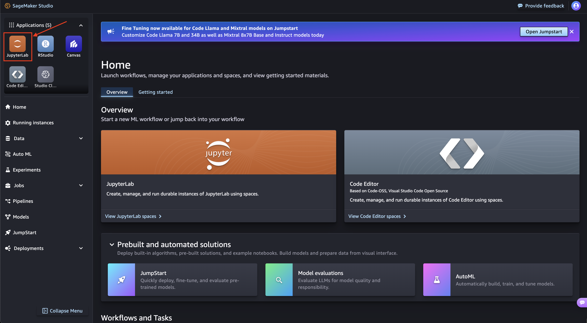

<!---- Provide an overview of what is being achieved in this repo ---->
# WXC FM workshop 2025

This repository includes contents for the Workshop on Weather Foundation Model: [Using Prithvi WxC FM](/Prithvi-WxC/notebooks/PrithviWxC_rollout.ipynb), and [Using Granite WxC](/Prithvi-WxC/notebooks/eccc_downscaling_finetune.ipynb).

# Prerequisites

1. Basic understanding of git
2. Python and jupyter environment knowledge
3. Machine Learning knowledge
4. Some understanding of Weather datasets.

# Getting started

1. Navigate to <a href="https://workshop-domain-4nkryygi.auth.us-west-2.amazoncognito.com/login?client_id=44jal9umgf2h0h7bp6s81notlc&response_type=code&scope=aws.cognito.signin.user.admin+openid+profile&redirect_uri=https://bsusccy257.execute-api.us-west-2.amazonaws.com/invoke" target="_blank">Login URL</a>
2. Log in using the credential provided

3. Once the Studio starts, Click on JupyterLab


4. <code style="color : red">A JupyterLab space should already be availble for you. If not, please follow along the next steps. Skip to Step 9 if the environment is already available.</code>
5. Click `Create JupyterLab Space`

6. Give it a name. Eg: `Workshop`
7. Once initialized, change Instance type to `ml.g6.2xlarge` and storage to `150`
8. Click on `Run Space`. If it throws an error, you might have to pick an Image. The top setting called `Latest` works.
9. If a space is already running, click on "open". This should open a new tab with the jupyterlab environment.


# Environment setup

The following steps are to be followed if the `WXC-FM-workshop-2025` folder is not available in your jupyterlab environment. If it is already available skip to 2.

1. Clone this repository `git clone https://github.com/NASA-IMPACT/WXC-FM-workshop-2025.git`

```
a. Click `git`
b. Click on `Git Clone Repo`
c. Paste `https://github.com/NASA-IMPACT/WXC-FM-workshop-2025.git` and Click on `Clone`.
```

2. Check conda environments

a. Open a terminal

b. Activate conda environment using `source /opt/conda/bin/activate`

c. List conda environments `conda env list`

d. Activate `prithvi_wxc` environment: `conda activate prithvi_wxc`

e. Open python terminal: `python`

f. Import torch: `import PrithviWxC`

<code style="color : red">Run the following only if there are issues with the conda environments</code>

If there are any issues with the environments, conda environments might need to be removed and reinstalled via the terminal:

```
conda activate base
conda remove -n prithvi_wxc --all -y

source /home/sagemaker/WXC-FM-workshop-2025/setup/setup.sh
```

[Please check the environment once the environments are set.](#environment-setup)

**Notebooks are available for each day which can be ran in the sagemaker environment.**
